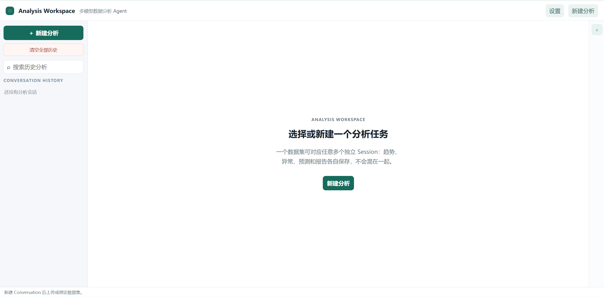
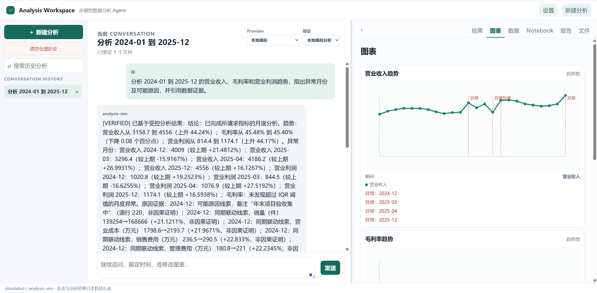

# 数据分析决策工作台

一个本地运行的通用分析工作台：上传 XLSX、XLS、CSV 或 DOCX 后，以可恢复的 Conversation 继续提问。每个 Conversation 独立保存消息、分析状态、数据文件绑定、证据、图表、报告和生成文件。

## 主要能力

- **自然语言驱动的数据分析**：用户直接提问，系统从数据中识别指标、维度和时间范围，生成可执行的分析计划，输出明确结论与数据证据。
- **智能诊断与决策支持**：自动完成趋势、排名、异常识别和对比分析；仅在满足时间序列条件时进行预测，并输出图表、报告和可追溯分析过程。
- **受控可信回答**：数据计算由确定性分析引擎完成；模型仅基于受控结果解释，已验证结论标记 `VERIFIED`，无法由数据证明的内容标记 `UNVERIFIED`。
- SQLite 持久化 Conversation / Message / AnalysisState；旧版 `sessions/*/session.json` 会在首次启动时迁移，不删除原文件。
- 每轮问题仍由受控分析引擎计算，结果保留证据、图表规格、Notebook 和 Markdown / HTML / DOCX 报告；模型不会直接执行代码或读取完整原始数据表。
- 支持本地模拟、OpenAI、Claude、Gemini、DeepSeek、Qwen、Kimi、智谱 GLM、MiniMax 及自定义 OpenAI 兼容接口。模型可在会话顶部切换，历史消息和工件不会丢失。
- API Key 保存在本机数据目录的 `providers.env`，设置页只展示是否已配置和脱敏状态；SQLite 不存储任何 Key。
- 左栏可新建、搜索、删除单个会话；“清空全部历史”必须二次确认，删除会话记录及其结果工件。

## 工作方式

1. 点击“新建分析”，上传新数据集或选择已有数据集，创建 Conversation。
2. 在中栏输入问题；每轮都先经确定性分析引擎，再由当前模型基于受控摘要生成回答。
3. 在右栏查看“结果 / 图表 / 数据 / Notebook / 报告 / 文件”，可以继续追问或对任一回答重新生成。
4. 从顶部模型选择器切换 Provider/模型；点击“模型设置”配置 Key、Base URL 与默认模型。
5. 拖动两条分隔线可调整三栏宽度；宽度会保存在浏览器本地。右栏支持全屏。

切换已完成的 Conversation 只读取保存的状态和工件，不会重新运行分析；只有发送新问题或点击“重新生成”才会发起下一轮分析。

## 界面预览

### 初始工作台



### 对话分析与图表结果



## 模型配置与密钥

默认 `simulated / analysis-sim` 不需要 Key，适合本地验收和演示，绝不会请求外部 API。需要真实模型时，在网页的“模型设置”选择 Provider、填写 Key，并保存默认地址与模型；应用会将它写入 `.analysis-studio-data/providers.env`（Docker 中为 `/data/providers.env`），重启后仍可使用。保存后再点击“测试已保存配置”，可以检查 Key、网络、账户权限和模型是否可用。旧版根目录或 `backend/.env` 中的配置会自动兼容读取，用户无需重新填写。

设置页仅保留当前主流且稳定的文本模型：OpenAI GPT-5.6、Claude 5 / Haiku 4.5、Gemini 3.7 / 3.6 Flash、DeepSeek V4、Qwen 3.8、Kimi K3 / K2.6、GLM-5.3 与 MiniMax M2.7。历史配置中的 `gpt-5`、`gpt-5-mini`、`deepseek-chat`、`deepseek-reasoner` 及已下线 Kimi ID 会自动迁移到可用替代模型；旧选项不会继续出现在界面中。

OpenAI 使用 Responses API，Claude 使用 Messages API，Gemini 使用 Interactions API；DeepSeek、Qwen、Kimi、GLM、MiniMax 和“自定义兼容接口”使用各自官方的 OpenAI Chat Completions 兼容地址。百炼 Qwen 默认使用中国（北京）地址；如你的百炼工作区在其他区域，请在设置中替换为该工作区官方提供的兼容地址。

`providers.env` 与 `.env` 均被 Git 忽略，请勿提交。`conversations.sqlite3` 只保存会话、消息、分析状态和工件索引，不包含密钥。

## 本机启动（默认，不依赖 Docker）

### 前置条件

- Git
- Python 3.12 或更高版本
- Node.js 与 pnpm（本项目已使用 pnpm 11 验证）

可先执行以下命令确认环境已安装：

```powershell
git --version
python --version
node --version
pnpm --version
```

```powershell
python -m venv .venv
.\.venv\Scripts\python.exe -m pip install -r requirements.txt
.\.venv\Scripts\python.exe -m uvicorn studio_api.app:app --app-dir backend --host 127.0.0.1 --port 8001
pnpm --dir apps/web install
pnpm --dir apps/web dev --host 127.0.0.1 --port 5173
```

前端会把 `/api` 转发到本地 API 的 `8001` 端口。首次启动会自动创建 `.analysis-studio-data/conversations.sqlite3`。

如需使用其他 API 端口，在启动前设置 `VITE_API_URL`，例如：

```powershell
$env:VITE_API_URL = "http://127.0.0.1:18001"
pnpm --dir apps/web dev --host 127.0.0.1 --port 5173
```

打开 `http://localhost:5173`。

## 开发与发布验证

```powershell
.\.venv\Scripts\python.exe -m pip install -r requirements-dev.txt
.\.venv\Scripts\python.exe -m pytest backend/tests -q --basetemp .pytest-tmp
pnpm --dir apps/web test --run
pnpm --dir apps/web build
git diff --check
```

发布前应在新目录重新克隆仓库并重复上述验证；只提交源码、测试、文档和示例配置，不提交 `.env`、运行数据、日志或覆盖率文件。

## Docker 发布（GitHub 推荐）

GitHub 发布建议保留本机启动作为最快上手方式，同时提供 Docker Compose 作为跨平台、一键运行方式。克隆仓库后只需：

```powershell
docker compose -f deploy/docker-compose.yml up -d --build
```

打开 `http://localhost:5173`。Docker 使用命名卷保存上传数据与 SQLite，升级容器不会清空会话历史。需要迁移或备份时，备份该卷中的 `/data` 即可。

## 开源许可

本项目采用 [Apache License 2.0](LICENSE) 开源。你可以使用、修改和分发代码；再分发时请保留许可证与必要的版权、声明信息。

## 决策边界

- 只运行固定分析函数，不执行用户或模型生成的代码。
- 预测只在用户请求预测、检测到时间列与数值列、且候选趋势模型优于朴素基线时推荐。
- DOCX 内容标为“文档陈述”，不会当成已验证数据事实。
- 医疗、法律、金融、化工与施工安全目标会标记人工复核；输出是辅助分析，不替代专业处置结论。
